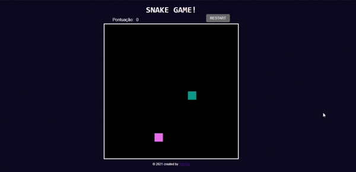

# Snake Game  🐍 - DIO

## Bootcamp - [HTML Web Developer](https://web.digitalinnovation.one/track/html-web-developer):

### Projeto  3:

<h1>
    
</h1>

Repositório do projeto prático proposto na aula do Bootcamp -HTML Web Developer da [Digital Innovation One](https://web.digitalinnovation.one/), ministrada pela especialista **Gabriela Pinheiro** , criação de um jogo, Snake Game.

### Features:

- Scoreboard

- Restart button

  

### Tecnologias Usadas:

  

Link para visualizar o jogo: [Clique aqui](https://PatriciaRodriguesR.github.io/DIO-Snake-Game/)

Made with 💜 by [**Patrícia Rodrigues**](https://github.com/PatriciaRodriguesR/) 👋

